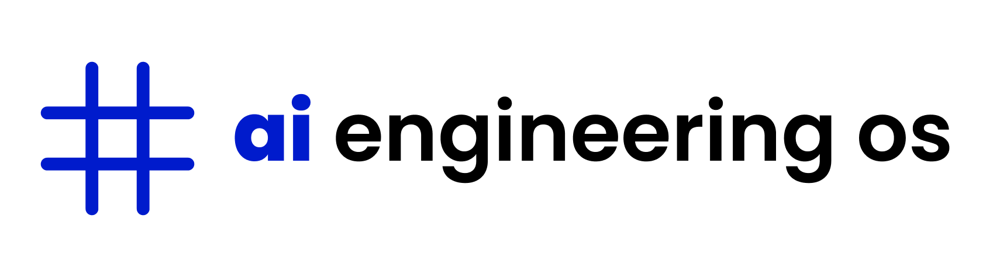

<p align="center">
  
</p>

<h1 align="center">AI-Augmented Engineering Operating System</h1>

<p align="center">
  <strong>Enterprise-grade framework for building software with AI-assisted development, strict engineering discipline, and human oversight at every critical layer.</strong>
</p>

<p align="center">
  <a href="docs/START-HERE.md">Start Here</a> ·
  <a href="docs/adopt-in-your-project.md">Adopt in Your Project</a> ·
  <a href="CONTRIBUTING.md">Contributing</a> ·
  <a href="LICENSE">License</a>
</p>

---

## Overview

**This is not a collection of prompts.** It is a complete engineering execution system: role-based agents, staged workflows, enforceable standards, starter kits, and adoption paths that bind AI assistance to **your** product repository.

| Principle | Commitment |
|-----------|------------|
| Human ownership | Architecture, security, and release decisions stay with engineers |
| AI acceleration | Agents execute within scoped prompts and checklists |
| Reviewability | Git discipline, PR limits, and human checkpoints at every stage |
| Track-aware delivery | Frontend, backend, full-stack, or single-task paths without noise |

## Choose Your Path

| I am building... | Entry point |
|------------------|-------------|
| Frontend only | [docs/paths/frontend-only.md](docs/paths/frontend-only.md) |
| Backend only | [docs/paths/backend-only.md](docs/paths/backend-only.md) |
| Full stack | [docs/paths/full-stack.md](docs/paths/full-stack.md) |
| One specific task | [docs/paths/single-task.md](docs/paths/single-task.md) |

**First time?** Read [docs/START-HERE.md](docs/START-HERE.md), then [docs/adopt-in-your-project.md](docs/adopt-in-your-project.md).

**Using Cursor?** Configure [MCP](docs/mcp-setup.md) to auto-resolve prompts by track.

## Platform Capabilities

| Layer | Location | Purpose |
|-------|----------|---------|
| Developer journey | [docs/developer-journey/](docs/developer-journey/) | Onboarding through ship and operate |
| Agents | [agents/](agents/) | Seven role-specific agent packages with enterprise prompts |
| Workflows | [workflows/](workflows/) | Eight-stage delivery playbooks and cross-cutting reviews |
| Prompts | [prompts/](prompts/) | Global prompts and [enterprise prompt contract](prompts/PROMPT-CONTRACT.md) |
| Standards | [standards/](standards/) | API, security, testing, observability, and git discipline |
| Starter kits | [starter-kits/](starter-kits/) | Six production-ready project templates |
| Architecture | [architecture/](architecture/) | ADRs and system patterns |
| Registry | [registry/](registry/) | Static asset manifest for remote distribution |

## Governance and Quality

- **Prompt contract** — every agent prompt follows a validated structure ([PROMPT-CONTRACT.md](prompts/PROMPT-CONTRACT.md))
- **Git discipline** — commit and PR size limits, branch naming, and protection guidance ([standards/git-workflow.md](standards/git-workflow.md))
- **Security and QA** — dedicated workflow stages and role checklists before merge
- **Human review** — mandatory checkpoints; nothing ships on AI approval alone

## Quick Start

```powershell
# Validate prompt contract compliance
.\scripts\validate-prompt-contract.ps1

# Install OS rules into your project (optional)
.\scripts\install-ai-os.ps1 -TargetPath C:\path\to\your-project
```

## Documentation

- [Feature delivery (8 stages)](docs/developer-journey/03-feature-delivery.md)
- [Coding with AI-OS](docs/developer-journey/05-coding-with-ai-os.md)
- [Decision tree](docs/developer-journey/06-decision-tree.md)
- [Security review prompt](workflows/prompts/stage-05-security-review.md)

---

<p align="center">
  <em>AI accelerates execution. Humans own the architecture.</em>
</p>

<p align="center">
  <sub>AI-Augmented Engineering Operating System · Enterprise Edition</sub>
</p>
