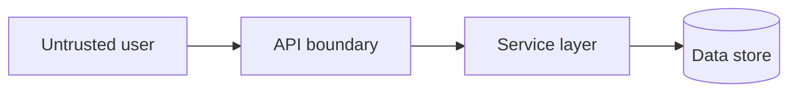

# Threat Model: [Feature / Service Name]

> **Status:** Draft | Under review | Approved
> **Author:** [agent / engineer]
> **Review date:** YYYY-MM-DD
> **Scope:** [PR link, ADR, or feature spec]

## System overview

[Brief description of the feature and its place in the architecture]

## Assets

| Asset | Sensitivity | Owner |
|-------|-------------|-------|
| [e.g., user PII] | High | |
| [e.g., API keys] | Critical | |

## Trust boundaries

| Boundary | Untrusted side | Trusted side | Controls |
|----------|----------------|--------------|----------|
| [Internet → API] | Public clients | Application | TLS, authn, rate limit |
| [Service → DB] | Application | Database | Authz, parameterized queries |

## Entry points

| Entry point | Auth required | Input sources |
|-------------|---------------|---------------|
| `POST /v1/resource` | Yes - [scheme] | body, headers |
| [Webhook] | Yes - [verification] | payload, headers |

## Threat analysis

### [Threat ID-001] - [Title, e.g., IDOR on resource access]

| Field | Detail |
|-------|--------|
| Category | Spoofing / Tampering / … |
| Attack path | [Attacker action] → [vulnerable path] → [impact] |
| Preconditions | [Auth level, knowledge required] |
| Current mitigations | [Controls in place] |
| Residual risk | Low / Medium / High |
| Verification | [Test, code review ref, scan] |
| Action required | [None / fix before merge / track] |

### [Threat ID-002] - [Title]

[Repeat table per significant threat]

## Data flows

| Flow | Data | Encryption | Validation |
|------|------|------------|------------|
| Client → API | [fields] | TLS | [schema] |
| API → DB | [fields] | [at rest] | [ORM/params] |

## Security controls checklist

- [ ] Authentication on all entry points (or documented exception)
- [ ] Authorization at service layer
- [ ] Input validation schemas
- [ ] Output encoding
- [ ] Rate limiting on public endpoints
- [ ] Secrets in vault
- [ ] Dependency scan clean for critical/high

## Open questions

1. [Ambiguity requiring human decision]

## Approval

| Role | Name | Date | Decision |
|------|------|------|----------|
| Security Engineer | | | Approved / Changes required |
| Human reviewer | | | |
