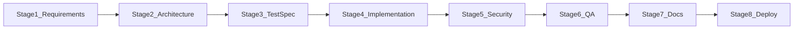

# 03 - Feature Delivery

The eight-stage path from requirement to production. Every stage has defined inputs, outputs, agents, prompts, and a **human checkpoint**.

## Overview

---

## Stage 1: Requirement Clarity

| | |
|---|---|
| **Input** | Feature request or task description |
| **Playbook** | [workflows/stage-01-requirement-clarity.md](../../workflows/stage-01-requirement-clarity.md) |
| **Prompt** | [workflows/prompts/stage-01-requirement-clarity.md](../../workflows/prompts/stage-01-requirement-clarity.md) |
| **Agent** | [architecture-engineer](../../agents/architecture-engineer/role.md) |
| **Output** | Approved feature specification ([templates/feature-spec.md](../../templates/feature-spec.md)) |
| **Human checkpoint** | Engineer signs off on acceptance criteria |

**Do here:** Resolve all ambiguities. No implementation until criteria are testable.

---

## Stage 2: Architecture Review

| | |
|---|---|
| **Input** | Approved feature specification |
| **Playbook** | [workflows/stage-02-architecture-review.md](../../workflows/stage-02-architecture-review.md) |
| **Prompt** | [workflows/prompts/stage-02-architecture-review.md](../../workflows/prompts/stage-02-architecture-review.md) |
| **Agent** | [architecture-engineer](../../agents/architecture-engineer/role.md) |
| **Output** | Implementation plan, API contract, ADR if structural |
| **Human checkpoint** | Lead engineer approves plan |

**Do here:** Write ADR for new services, databases, or dependencies. Define API contract before code.

---

## Stage 3: Test Specification

| | |
|---|---|
| **Input** | Approved implementation plan |
| **Playbook** | [workflows/stage-03-test-specification.md](../../workflows/stage-03-test-specification.md) |
| **Prompt** | [workflows/prompts/stage-03-test-specification.md](../../workflows/prompts/stage-03-test-specification.md) |
| **Agent** | [qa-engineer](../../agents/qa-engineer/role.md) |
| **Output** | Test specification ([templates/test-spec.md](../../templates/test-spec.md)) |
| **Human checkpoint** | Engineer confirms coverage is sufficient |

**Do here:** Cover happy path, edge cases, auth rules, and failure modes before writing feature code.

---

## Stage 4: Implementation

| | |
|---|---|
| **Input** | Approved test specification |
| **Playbook** | [workflows/stage-04-implementation.md](../../workflows/stage-04-implementation.md) |
| **Prompt** | [workflows/prompts/stage-04-implementation.md](../../workflows/prompts/stage-04-implementation.md) |
| **Agents** | [backend-engineer](../../agents/backend-engineer/role.md), [frontend-engineer](../../agents/frontend-engineer/role.md) |
| **Output** | Implementation with tests on `feature/*` branch |
| **Human checkpoint** | Engineer reviews before PR |

**Do here:** Read codebase first. Tests alongside code. Complete pre-delivery checklist.

---

## Stage 5: Security Review

| | |
|---|---|
| **Input** | Completed implementation (PR) |
| **Playbook** | [workflows/stage-05-security-review.md](../../workflows/stage-05-security-review.md) |
| **Prompt** | [workflows/prompts/stage-05-security-review.md](../../workflows/prompts/stage-05-security-review.md) |
| **Agent** | [security-engineer](../../agents/security-engineer/role.md) |
| **Output** | Security sign-off or required changes |
| **Human checkpoint** | Security engineer approves or escalates |

**Do here:** Trace attacker input to sinks. Report only medium+ with evidence.

---

## Stage 6: QA Verification

| | |
|---|---|
| **Input** | Security-cleared implementation |
| **Playbook** | [workflows/stage-06-qa-verification.md](../../workflows/stage-06-qa-verification.md) |
| **Prompt** | [workflows/prompts/stage-06-qa-verification.md](../../workflows/prompts/stage-06-qa-verification.md) |
| **Agent** | [qa-engineer](../../agents/qa-engineer/role.md) |
| **Output** | QA report ([templates/qa-report.md](../../templates/qa-report.md)) |
| **Human checkpoint** | QA signs off on release readiness |

**Do here:** Run full suite in CI. Confirm zero regressions. Attach QA report to PR.

---

## Stage 7: Documentation

| | |
|---|---|
| **Input** | QA-verified implementation |
| **Playbook** | [workflows/stage-07-documentation.md](../../workflows/stage-07-documentation.md) |
| **Prompt** | [workflows/prompts/stage-07-documentation.md](../../workflows/prompts/stage-07-documentation.md) |
| **Agent** | [devrel-engineer](../../agents/devrel-engineer/role.md) |
| **Output** | Updated API reference, guides, changelog |
| **Human checkpoint** | One engineer reviews documentation |

**Do here:** Verify every code sample runs. Every error message is actionable.

---

## Stage 8: Production Deployment

| | |
|---|---|
| **Input** | Documentation-complete implementation |
| **Playbook** | [workflows/stage-08-production-deployment.md](../../workflows/stage-08-production-deployment.md) |
| **Prompt** | [workflows/prompts/stage-08-production-deployment.md](../../workflows/prompts/stage-08-production-deployment.md) |
| **Agent** | [sre-engineer](../../agents/sre-engineer/role.md) |
| **Output** | Feature live in production |
| **Human checkpoint** | SRE confirms healthy deployment |

**Do here:** Pre-production checklist, smoke tests, monitor dashboards.

---

**After Stage 8:** [04-ship-and-operate.md](04-ship-and-operate.md)
