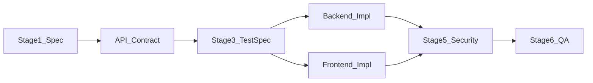

# Full-Stack Path

For features that span API and UI. Contract-first: define API before parallel implementation.

## 1. Adopt the OS in your project

[adopt-in-your-project.md](../adopt-in-your-project.md). Set `track: fullstack` in `ai-os.config.yaml`.

## 2. Read these only (6 files)

1. [templates/project-context.md](../../templates/project-context.md)
2. [ai-collaboration/prompting-rules.md](../../ai-collaboration/prompting-rules.md)
3. [ai-collaboration/human-review-checklist.md](../../ai-collaboration/human-review-checklist.md)
4. [standards/api.md](../../standards/api.md)
5. [agents/backend-engineer/role.md](../../agents/backend-engineer/role.md) (API half)
6. [agents/frontend-engineer/role.md](../../agents/frontend-engineer/role.md) (UI half)

## 3. Starter kits

- API: [fastapi-enterprise](../../starter-kits/fastapi-enterprise/) or [nextjs-enterprise](../../starter-kits/nextjs-enterprise/) API routes
- UI: [nextjs-enterprise](../../starter-kits/nextjs-enterprise/)

Or monorepo with both apps under one repo.

## 4. Recommended flow

| Stage | Agent(s) |
|-------|----------|
| 1-2 | architecture-engineer (API contract + ADR if needed) |
| 3 | qa-engineer |
| 4a | backend-engineer (API first or parallel with mocked UI) |
| 4b | frontend-engineer (against real or mocked API) |
| 5-8 | security, qa, devrel, sre per [03-feature-delivery.md](../developer-journey/03-feature-delivery.md) |

**Rule:** Do not merge UI that calls undocumented endpoints. OpenAPI is the contract.

## 5. Split PRs when possible

- PR 1: API + tests (under 400 lines)
- PR 2: UI consuming API (under 400 lines)

See [standards/pull-request.md](../../standards/pull-request.md).

## 6. First prompts

1. Architecture: [stage-02-architecture-review.md](../../workflows/prompts/stage-02-architecture-review.md)
2. Backend: [backend-engineer/prompts/primary.md](../../agents/backend-engineer/prompts/primary.md)
3. Frontend: [frontend-engineer/prompts/primary.md](../../agents/frontend-engineer/prompts/primary.md)

**Next:** [03-feature-delivery.md](../developer-journey/03-feature-delivery.md)
